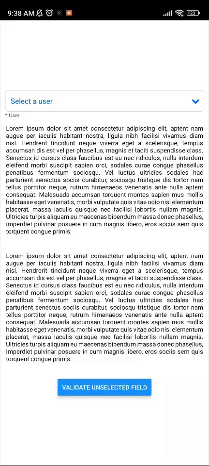
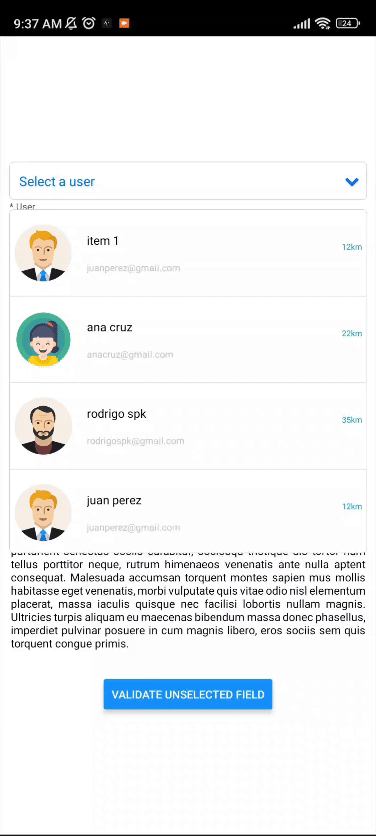

# react-native-spk-dropdown

The element is a DropDown component that is displayed on top of any content attached to the element, without moving the other elements of the graphical interface.

## Instalación

To install use the following commands:
```bash
npm install react-native-spk-dropdown
````

```bash
yarn add react-native-spk-dropdown
````


## With simple usage




### Simple Data

```javascript
const data = [
  {
    value: 1,
    label: "item 1"
  },
  {
    value: 2,
    label: "item 2"
  },
  {
    value: 3,
    label: "item 3"
  }
];
```

### Simple use

```javascript
import React, { useState } from 'react';
import { StyleSheet, View } from 'react-native';
import Dropdown from 'react-native-spk-dropdown';


export default function App() {

  const [selectedItem, setSelectedItem] = useState();

  return (
    <View style={styles.container}>
      <Dropdown
        data={data}
        selectedItem={selectedItem}
        placeholder={"Select a item"}
        onChange={(item) => { setSelectedItem(item) }}
        label={"Category"}
      />
    </View>
  );
}

const styles = StyleSheet.create({
  container: {
    flex: 1,
    alignItems: 'center',
    justifyContent: 'center',
    paddingHorizontal: 10,
    backgroundColor: '#fff'
  }
});
```

## With more personalized items




### Data

```javascript
const dataUsers = [
  {
    value: 1,
    label: "juan perez",
    name: "juan perez",
    image: "https://cdn1.iconfinder.com/data/icons/user-pictures/101/malecostume-512.png",
    email: "juanperez@gmail.com",
    km: "12km"
  },
  {
    value: 2,
    label: "ana cruz",
    name: "ana cruz",
    image: "https://cdn4.iconfinder.com/data/icons/avatars-xmas-giveaway/128/girl_avatar_child_kid-256.png",
    email: "anacruz@gmail.com",
    km: "22km"
  },
  {
    value: 3,
    label: "rodrigo spk",
    name: "rodrigo spk",
    image: "https://cdn0.iconfinder.com/data/icons/user-pictures/100/matureman1-2-512.png",
    email: "rodrigospk@gmail.com",
    km: "35km"
  },
];
```

### Usage

```javascript

import React, { useState } from 'react';
import { 
    Button, 
    Image, 
    StatusBar, 
    StyleSheet, 
    Text, 
    View } 
from 'react-native';
import Dropdown from 'react-native-spk-dropdown';


export default function App() {

  const [selectedItem, setSelectedItem] = useState();
  const [errorVisibility, setErrorVisibility] = useState(false);
  
  return (
    <View style={styles.container}>
      <StatusBar></StatusBar>
      <Dropdown
        data={dataUsers}
        selectedItem={selectedItem}
        placeholder={"Select a user"}
        onChange={(item) => { setSelectedItem(item) }}
        primaryColor={"#14a4ac"}
        boxIconColor={"#14a4ac"}
        boxIconZise={15}
        required={true}
        label={"User"}
        errorVisibility={errorVisibility}
        setErrorVisibility={(value) => { setErrorVisibility(value) }}
        errorMessage={"Unselected user"}
        itemBoxSelected={(item) => renderItem(item, "box")}
        listItem={({ item }) => renderItem(item, "list")}
      />
      < Text style={{ textAlign: 'justify', marginVertical: 50 }}>
        Lorem ipsum dolor sit amet consectetur adipiscing elit, aptent nam augue per iaculis habitant nostra,
        ligula nibh facilisi vivamus diam nisl. Hendrerit tincidunt neque viverra eget a scelerisque,
        tempus accumsan dis est vel per phasellus, magnis et taciti suspendisse class.
        Senectus id cursus class faucibus est eu nec ridiculus, nulla interdum eleifend morbi suscipit sapien orci,
        sodales curae congue phasellus penatibus fermentum sociosqu.
        Vel luctus ultricies sodales hac parturient senectus sociis curabitur,
        sociosqu tristique dis tortor nam tellus porttitor neque, rutrum himenaeos venenatis ante nulla aptent consequat.
        Malesuada accumsan torquent montes sapien mus mollis habitasse eget venenatis,
        morbi vulputate quis vitae odio nisl elementum placerat, massa iaculis quisque nec facilisi lobortis nullam magnis.
        Ultricies turpis aliquam eu maecenas bibendum massa donec phasellus, imperdiet pulvinar posuere in cum magnis libero,
        eros sociis sem quis torquent congue primis.
      </Text >

      <Button onPress={() => {
        setErrorVisibility(!errorVisibility);
      }} title={"Validate unselected field"} />
    </View >
  );
}

const styles = StyleSheet.create({
  container: {
    flex: 1,
    alignItems: 'center',
    justifyContent: 'center',
    paddingHorizontal: 10,
    backgroundColor: '#fff'
  },
  //styles for custom items
  card: {
    alignItems: 'flex-start',
    justifyContent: 'center',
    height: 90,
    width: '100%'
  },
  ticket: {
    flexDirection: "row",
    alignItems: "center",
    justifyContent: "center"
  },
  avatarContainer: {
    width: 70,
    justifyContent: "center",
    alignItems: "center"
  },
  avatar: {
    width: 60,
    height: 60,
    borderRadius: 30
  },
  infoContainer: {
    flex: 1,
    paddingLeft: 10
  },
  nameKmSection: {
    width: "100%",
    justifyContent: "center",
    flexDirection: 'row',
    alignItems: "center",
    height: '50%'
  },
  nameContainer: {
    flex: 1,
    justifyContent: "flex-start"
  },
  kmContainer: {
    justifyContent: "flex-start",
    paddingRight: 5
  },
  textKm: {
    color: "#14a4ac",
    fontSize: 10
  },
  emailContainer: {
    width: '100%'
  },
  textEmail: {
    fontSize: 12,
    color: "#bdc3c7"
  }
});
```
## itemBoxSelected and listItem props examples
Individual personalized section (TICKET) for data management.
It is always possible to manage independent elements for both "itemBoxSelected" and "listItem", however for the example the same component is used, the only difference is the "type" parameter, the same one that allows comparing and highlighting the selected item from the list.


```javascript
function renderItem(item, type) {
    return (
      <View style={(type === "list")
        ?
        [styles.card, { backgroundColor: (selectedItem?.value == item.value) ? 'rgba(20, 164, 172, 0.2)' : "#fff" }]
        :
        styles.card
      }>
        <View style={styles.ticket}>

          {/* Image section */}
          <View style={styles.avatarContainer}>
            <Image
              style={styles.avatar}
              source={{ uri: item.image }}
              resizeMode={"cover"}
            />
          </View>

          {/* Info Section */}
          <View style={styles.infoContainer}>
            <View style={styles.nameKmSection}>

              {/* Name */}
              <View style={styles.nameContainer}>
                <View style={{ flex: 1 }}>
                  <Text style={{
                    fontSize: 15,
                    color: (selectedItem?.value == item.value) ? "#14a4ac" : "#000"
                  }}>{item.name}</Text>
                </View>
              </View>

              {/* Distance */}
              <View style={styles.kmContainer}>
                <Text style={styles.textKm}>{item.km}</Text>
              </View>
            </View>

            {/* Email */}
            <View style={styles.emailContainer}>
              <Text style={styles.textEmail}>{item.email}</Text>
            </View>
          </View>
        </View>
      </View>
    )
  }
```

## Props

<table>
    <thead>
        <tr>
            <th style="text-align:center;">prop</th>
            <th style="text-align:center;">Type</th>
            <th style="text-align:center;">Description</th>
        </tr>
    </thead>
    <tbody>
        <tr>
            <td>data</td>
            <td>Array</td>
            <td>The data to be displayed in the component.</td>
        </tr>
        <tr>
            <td>selectedItem</td>
            <td>Object</td>
            <td>The currently selected item in the list.
            </br>
            {value: 1, label: "item 1"}
            </td>
        </tr>
        <tr>
            <td>placeholder</td>
            <td>string</td>
            <td>Placeholder text displayed when no item is selected.</td>
        </tr>
        <tr>
            <td>onChange</td>
            <td>Function</td>
            <td>Function that is called when the selection is changed.</td>
        </tr>
        <tr>
            <td>required</td>
            <td>Boolean</td>
            <td>Required selection element indicator (*).</td>
        </tr>
        <tr>
            <td>primaryColor</td>
            <td>string</td>
            <td style="text-align: justify;">Main color to highlight selected elements.</br>
            'rgba(20, 164, 172, 0.2)'</br>"#fff"</td>
        </tr>
        <tr>
            <td>boxStyle</td>
            <td>Object</td>
            <td style="text-align: justify;">Style of the box containing the component the currently selected element.
            </br>
            { backgroundColor: '#fff', height: 40 }
            </td>
        </tr>
        <tr>
            <td>boxTextStyle</td>
            <td>Object</td>
            <td style="text-align: justify;">Text style inside the box.
            </br>
            { color: '#14a4ac', fontSize: 15 }
            </td>
        </tr>
        <tr>
            <td>boxIconColor</td>
            <td>string</td>
            <td style="text-align: justify;">Color of the icon (drop-down arrow) inside the box.</td>
        </tr>
        <tr>
            <td>boxIconSize</td>
            <td>Number</td>
            <td style="text-align: justify;">Size of the icon (drop-down arrow) inside the box.</td>
        </tr>
        <tr>
            <td>label</td>
            <td>string</td>
            <td style="text-align: justify;">Selection box title.</td>
        </tr>
        <tr>
            <td>labelStyle</td>
            <td>Object</td>
            <td style="text-align: justify;">Label style.
            </br>
            { fontSize: 13, color: '#000' }
            </td>
        </tr>
        <tr>
            <td>errorMessage</td>
            <td>string</td>
            <td style="text-align: justify;">Error message displayed in case of failed validation.</td>
        </tr>
        <tr>
            <td>errorVisibility</td>
            <td>Boolean</td>
            <td style="text-align: justify;">Indicates whether the error message is displayed.</td>
        </tr>
        <tr>
            <td>setErrorVisibility</td>
            <td>Function</td>
            <td style="text-align: justify;">Function to change the visibility of the error message.</td>
        </tr>
        <tr>
            <td>listContainerStyle</td>
            <td>Object</td>
            <td style="text-align: justify;">Estilo del contenedor de la lista desplegable.
            </br>
            { backgroundColor: '#fff' }
            </td>
        </tr>
        <tr>
            <td>itemListStyle</td>
            <td>Object</td>
            <td style="text-align: justify;">Style of the external container of the drop-down list.
            </br>
            { backgroundColor: '#fff' }
            </td>
        </tr>
        <tr>
            <td>itemTextStyle</td>
            <td>Object</td>
            <td style="text-align: justify;">Text style for list items. The style will be applied as long as a "listItem" element does not exist.
            </br>
            { fontSize: 13, color: '#000' }
            </td>
        </tr>
        <tr>
            <td>listItem</td>
            <td>Function</td>
            <td style="text-align: justify;">Custom list item.
            </br>
            (item) => View          
            </td>
        </tr>
        <tr>
            <td>itemBoxSelected</td>
            <td>Function</td>
            <td style="text-align: justify;">Selected list item display custom item.
            </br>
            (item) => View
            </td>
        </tr>
    </tbody>
</table>


